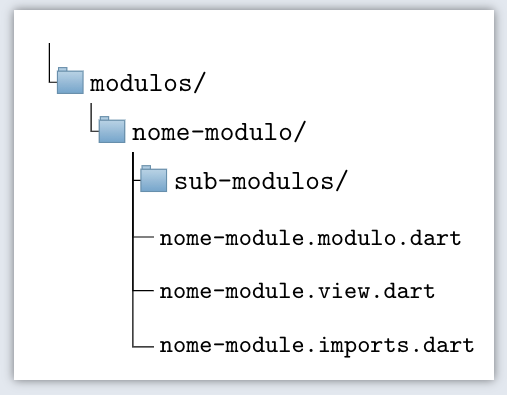

# Criar modulo

Instruções de como criar um modulo

## 1. Criar diretório

 <!-- Dentro da pasta modulos, crie a pasta do modulo e dentro dessa nova pasta crie os arquivos que vão compor o modulo, da seguinte forma: -->

 Dentro da pasta modulos crie uma pasta com o nome do novo modulo. Em seguida, dentro dessa nova pasta crie os arquivos seguindo a estrutura básica de um modulo, conforme imagem abaixo: 

Nos próximos passos iremos preencher os conteúdos dos arquivos criados, por enquanto podem ficar vazios. 

## 2. Estrutura e arquivos

Nesse próximo passo iremos entender cada arquivo que compõe a estrutura de um módulo.

### Arquivo .view

O arquivo que possui a extensão ***".view"*** será responsável pela parte visual do nosso modulo.

 Existem situações onde esse arquivo não será usado, por exemplo no caso de um modulo composto que não possui uma view, mas contém submodulos onde estes sim possuem suas respectivas views. 
  Pra ficar mais fácil de entender, pegue como exemplo um modulo chamado clientes, que tem a tarefa de gerenciar os clientes da empresa. O modulo clientes em si não possui a camada view, mas este modulo contém dois sub-modulos: clientes_formulario e clientes_relatório, onde cada um desses submodulos possuem a sua camada view.   

###  Arquivo .modulo

O arquivo que possui a extensão ***".modulo"*** é o arquivo de acesso e controle do nosso modulo. Esse arquivo disponibiliza a view e o controller do nosso modulo

###  Pasta sub-modulos

Um modulo pode ser composto de diferentes sub-modulos conforme for necessário. Na maioria dos casos os modulos seguem um padrão de dois sub-modulos, sendo um deles referente a tela de formulário e o outro sub-modulo é referente a tela de relatório.

## 3. Publicar o modulo